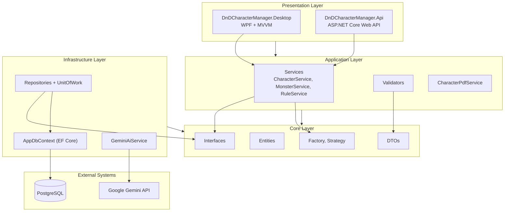
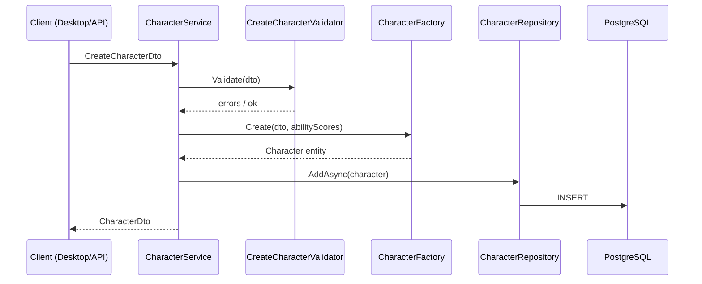

# Архитектура DnD Character Manager

Проект следует **Clean Architecture** с разделением на независимые слои и инверсией зависимостей (зависимости направлены внутрь, к Core).

## Слои



## Принципы

| Принцип | Реализация |
|---------|------------|
| Dependency Inversion | Core определяет `ICharacterRepository`, `ICharacterService`; Infrastructure и Application реализуют |
| Separation of Concerns | UI не содержит бизнес-логики; ViewModel делегирует сервисам |
| Mobile-ready | Общий API + DTO позволяют подключить MAUI / Flutter без изменения Core |
| Testability | Сервисы зависят от интерфейсов; тесты используют InMemory EF и моки |

## Поток данных (CRUD персонажа)



## Зависимости проектов

```
Desktop  → Application, Core
Api      → Application, Infrastructure
Application → Core
Infrastructure → Core
Tests    → Application, Infrastructure, Core
```

Core не ссылается ни на один внешний слой.
