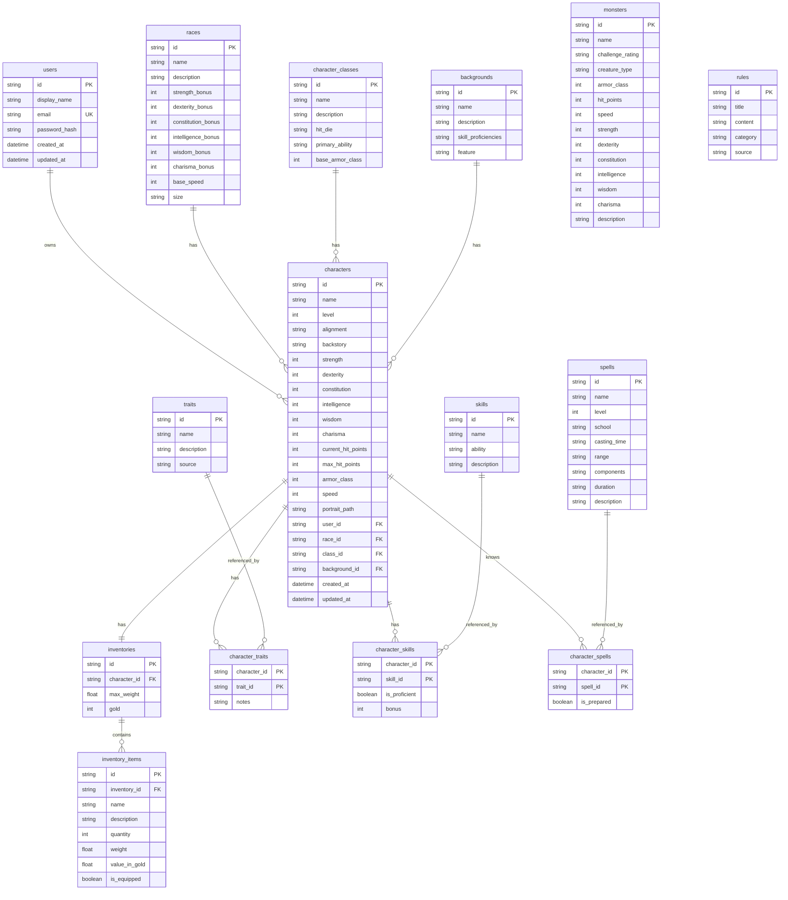

# ER-диаграмма базы данных

Схема нормализована до **3НФ**: справочники (расы, классы, навыки и т.д.) вынесены в отдельные таблицы; связи M:N реализованы через промежуточные таблицы.

## Нормализация (3НФ)

| Таблица | Обоснование |
|---------|-------------|
| `users` | Данные пользователя не зависят от персонажей |
| `races`, `character_classes`, `backgrounds` | Справочники без транзитивных зависимостей |
| `characters` | Только FK на справочники; характеристики принадлежат персонажу |
| `character_traits`, `character_skills`, `character_spells` | M:N без дублирования атрибутов справочников |
| `inventories` / `inventory_items` | Инвентарь отделён от персонажа; предметы — отдельные записи |
| `monsters`, `rules` | Независимые справочники бестиария и правил |

## Типы связей

- **1:M** — `users` → `characters`, `races` → `characters`, `inventories` → `inventory_items`
- **1:1** — `characters` → `inventories` (`character_id` уникален)
- **M:N** — `characters` ↔ `traits`, `skills`, `spells` через join-таблицы

## Примечание к диаграмме

В Mermaid для ER допускается только один маркер ключа на поле (`PK`, `FK` или `UK`). Составные ключи join-таблиц показаны двумя полями с `PK`; внешние ключи — через связи `||--o{` и поля `FK`.
