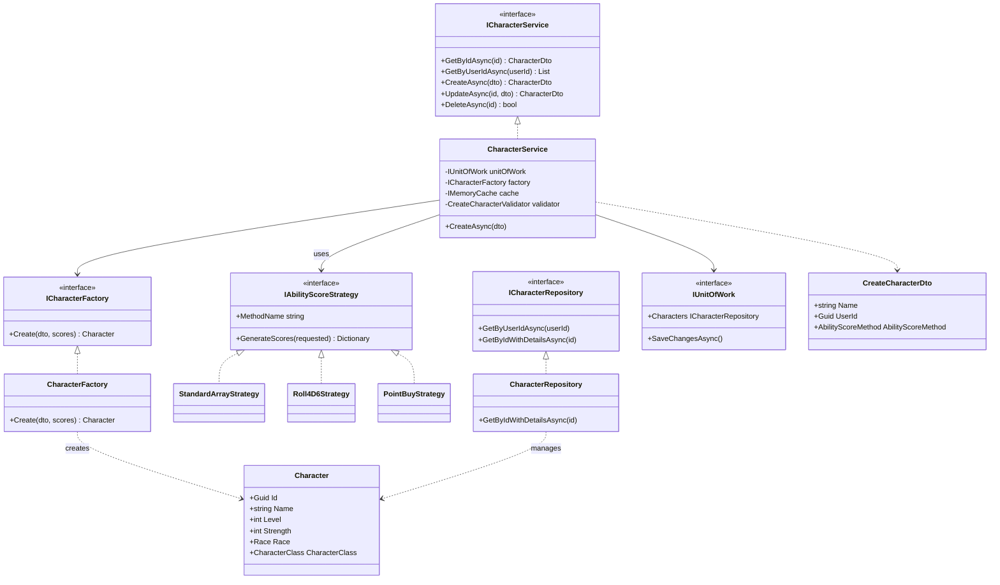
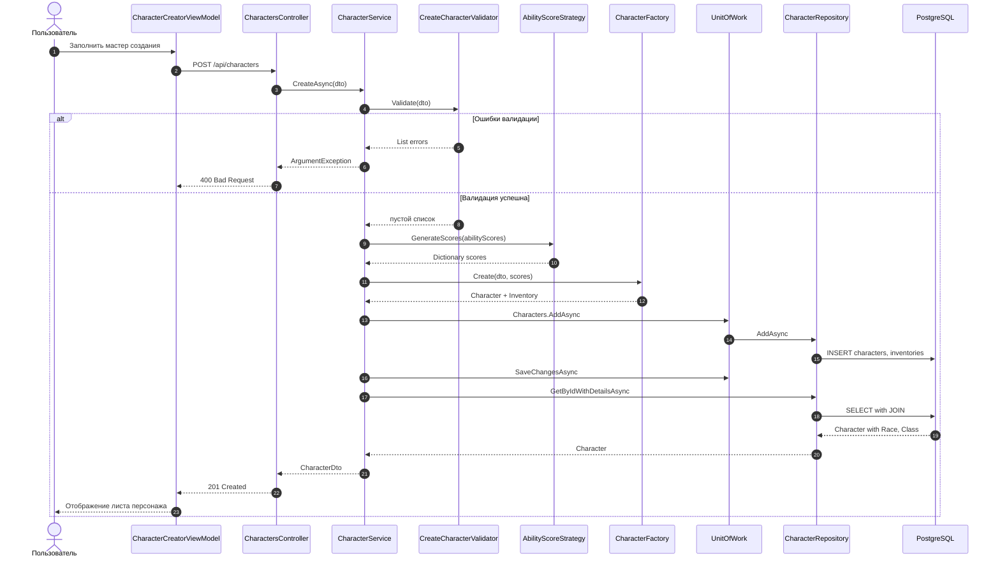
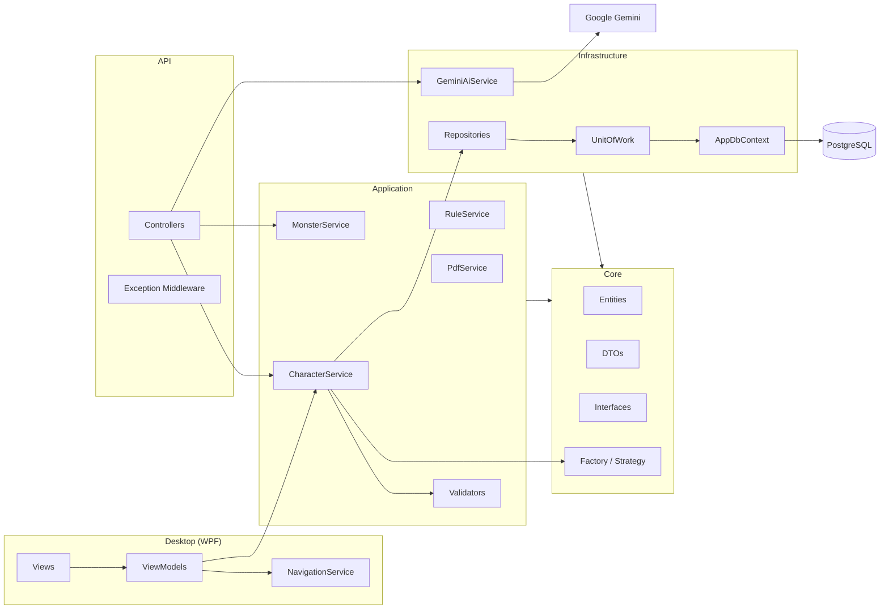

# UML-диаграммы DnD Character Manager

## Диаграмма классов (основные компоненты)

## Диаграмма последовательности: создание персонажа

## Диаграмма компонентов

## Описание ключевых связей

- **ViewModel → Service**: MVVM не обращается к БД напрямую; все операции через `ICharacterService`.
- **Service → Strategy**: метод генерации характеристик выбирается по `AbilityScoreMethod` в DTO.
- **Service → Factory**: фабрика собирает `Character` и связанный `Inventory` из DTO и рассчитанных scores.
- **Repository → DbContext**: EF Core Fluent API конфигурирует связи 1:M и M:N.
